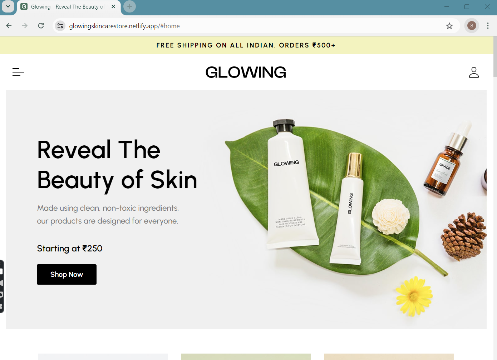
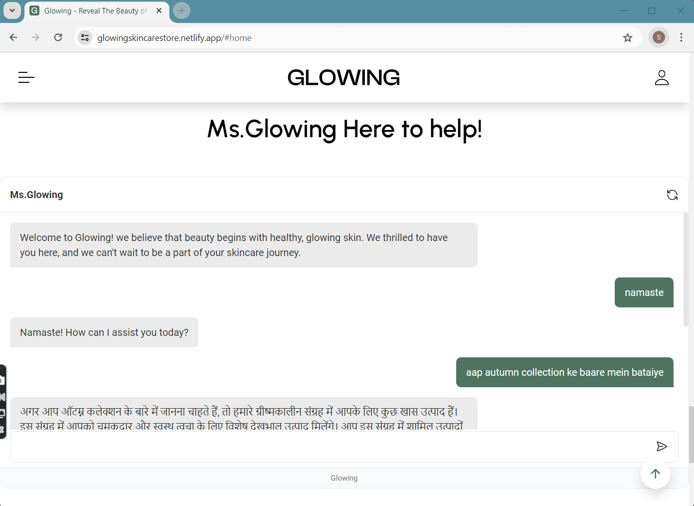
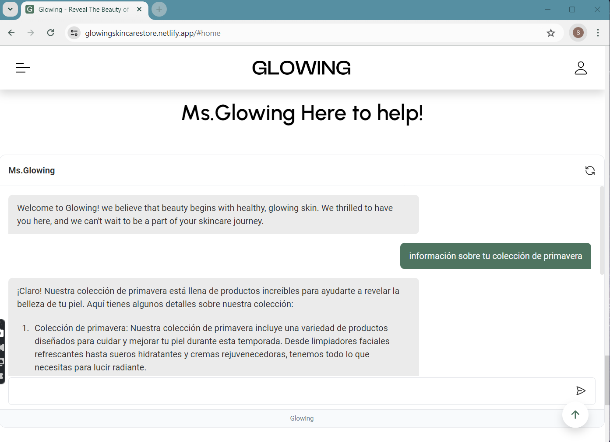

  <h2 align="center">Glowing - ECommerce Website</h2>

  Glowing is a fully responsive ecommerce website,  Responsive for all devices, build using HTML, CSS, and JavaScript.
  It comes with an AI supportive chatbot that is multilingual.

  <a href="https://glowingskincarestore.netlify.app/"><strong>➥ Live Demo</strong></a>

 

### Screenshots

<b>Main Website View</b>
 

 

<b>Chatbot conversation in hindi</b>
 

 

<b>Chatbot conversation in spanish</b>
 

 

### Prerequisites

Before you begin, ensure you have met the following requirements:

* [Git](https://git-scm.com/downloads "Download Git") must be installed on your operating system.

